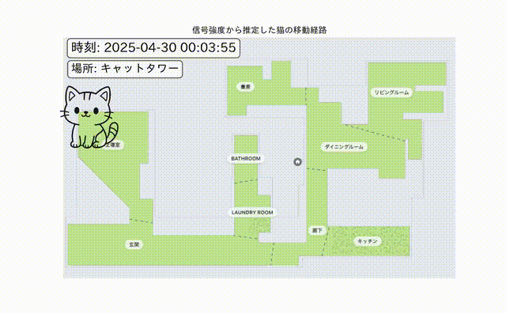

# catlog_beacon

このリポジトリは、Catlog PendantなどのBLEビーコンのRSSI（受信信号強度）を測定、記録、分析、および場所推定を行うためのツール群です。

## ファイル説明

### スクリプト・ノートブック

- **`ble_all_live_plot.py`**: 周辺の全BLEデバイスのRSSIをリアルタイムでスキャンし、グラフ表示します。
- **`catlog_live_inference.py`**: 特定デバイス("Cat"*)のRSSIを監視し、機械学習モデルで場所を推論してSlackに通知、CSVに記録します。
- **`catlog_live_plot.py`**: 特定デバイス("Cat"*)のRSSIをリアルタイムでプロットし、全履歴をグラフ表示・CSV記録します。
- **`scan_all.py`**: 短時間スキャンし、検出された全BLEデバイスの情報をRSSI順にリスト表示します。
- **`create_training_data.py`**: `rssi_inference_log.csv` から指定した時間範囲のデータを切り出し、教師データとして `data/` ディレクトリに保存します。
- **`eda_classification.ipynb`**: `data/` 内の教師データCSVから場所分類モデルを訓練し、`location_classification_bundle.joblib` を生成します。

### データディレクトリ

- **`data/`**: 場所分類モデルの訓練用教師データ（CSVファイル）を格納します。ファイル名に場所を含めます (例: `xxxx_リビング.csv`)。

### 生成されるファイル (例)

- **`rssi_log.csv`**: `catlog_live_plot.py` が生成する、ターゲットデバイスのRSSIログ。
- **`rssi_inference_log.csv`**: `catlog_live_inference.py` が生成する、RSSIと場所の推論結果ログ。
- **`location_classification_bundle.joblib`**: `eda_classification.ipynb` が生成する、訓練済みモデルバンドル。

## デモ

